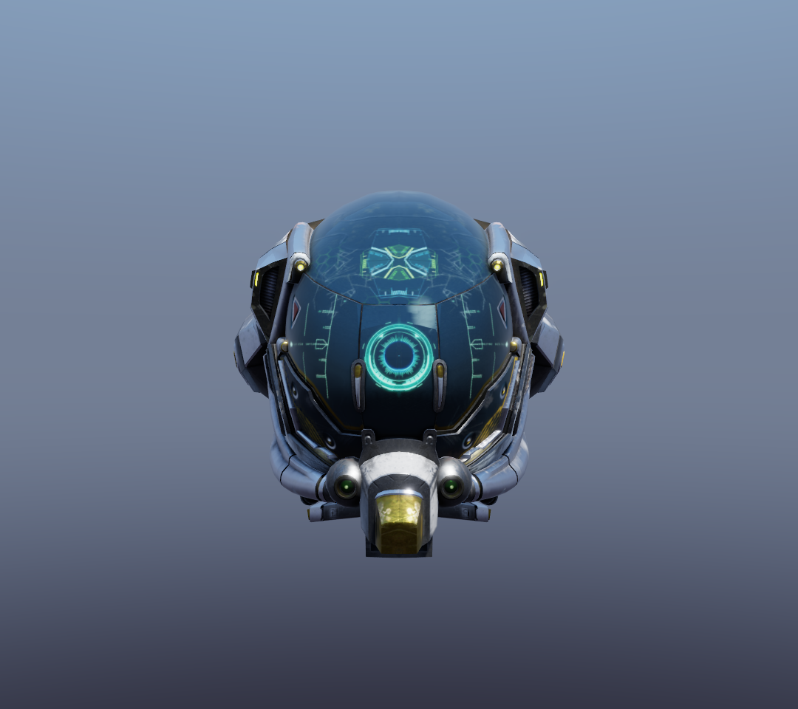
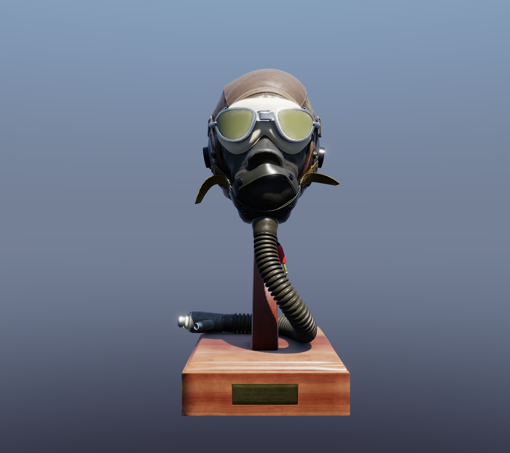

# vulkan_render

A Vulkan renderer written in modern C++23 (C++20 modules / `.cppm`), implementing a glTF 2.0 PBR (metallic-roughness) pipeline with CPU-precomputed split-sum IBL lighting, a scene tree with BVH frustum culling, directional shadows, and a Dear ImGui debug overlay.

<p align="center">
  
  
</p>

## Features

- **Vulkan wrapper (`vulkan` module)**: C++ modules wrapping the full initialization flow — instance / device / swapchain / pipeline / command buffer. The `vulkan::runtime` facade is created with a `core_create_info` (window size / title / vsync / MSAA) and renders a complete frame with a single `render_frame()` call — or through its split frame steps (`is_skipable` → `try_recreate_swap_chain_if_minimized` → `set_up_frame_environment` → `begin_recording` → `record_main_drawcalls` → `end_recording` → `submit_and_present`), each returning a `frame_status` (`proceed` / `skipped` / `closed` / per-stage `*_failed`), so external code can interleave its own recording. All scene-wide GPU resources (shared camera UBO, texture array, IBL, material table, shadow maps) are owned by the runtime.
- **Scene tree (`vulkan.runtime.scene_tree`)**: scene storage is a tree of nodes (name + local transform + children + a primitive leaf), walked once per frame to accumulate world matrices. Every GPU drawable is a `primitive` subclass (`normal_draw_primitive` / `instanced_draw_primitive`...) with a polymorphic `draw()` — new draw strategies only add a subclass.
- **BVH frustum culling**: per-frame, a BVH is built over every leaf's world AABB and tested against the camera frustum; the tree is rebuilt only when the scene changed and the culled result is reused while the camera is static (`visible/total` logged every 30 frames). Toggle with `set_frustum_culling()`.
- **Dynamic rendering**: frames are rendered through `vkCmdBeginRendering` (Vulkan 1.3 dynamic rendering) when the device supports it — no render pass / framebuffer objects exist on that path; devices without dynamic rendering automatically fall back to a classic render pass + framebuffers. MSAA resolve works on both paths. The shadow pass is depth-only dynamic rendering.
- **Single descriptor set (descriptor indexing)**: every pipeline shares one flat scene set — camera UBO (binding 0), `sampler2D textures[]` runtime array (binding 1, partially bound + update-after-bind + non-uniform indexing), shared IBL images (bindings 2–4), the GPU material table (binding 5, a storage buffer), per-instance transforms (binding 6), the light UBO (binding 7) and the shadow map (binding 8). The runtime binds this one set once per frame; each primitive only pushes an 80-byte block (`material_index` + model matrix). The descriptor set / pipeline layouts are an agreed fixed convention (not parsed from SPIR-V), so no per-pipeline layout objects exist.
- **GPU material table**: each material is one `material_record` in the storage buffer (5 texture-array indices + factors + flags). A primitive references a material by index, the shader reads `materials[push.material_index]` and samples `textures[<index>]` — material data is stored once on the GPU and shareable between primitives.
- **PBR rendering**: standard metallic-roughness workflow with five texture slots — albedo (sRGB), metallic-roughness, normal, occlusion, emissive — falling back to a 1×1 white texture when missing; all material parameters come from the material table.
- **IBL lighting**: CPU-precomputed environment cubemap → GGX importance-sampled prefiltered environment (mip chain), irradiance map, and BRDF LUT (split-sum), uploaded as `R16G16B16A16_SFLOAT` cubemaps / `R16G16_SFLOAT` LUT. Precompute resolutions are configurable.
- **Directional shadows**: orthographic shadow pass rendering the scene's depth from the sun (2048² dynamic-rendering depth pass, manual PCF in the shader); enabled over the imported scene's bounds.
- **Debug GUI (`vulkan.gui`)**: a Dear ImGui overlay driven inside the runtime's frame steps. `vulkan::gui::widget` subclasses (`label_widget` / `checkbox_widget` / `slider_widget` / `vec3_widget`...) stack into `debug_panel`s that register with `gui_content` via `runtime::debug_gui()`. The demo panel shows fps and toggles frustum culling, the skybox pass, the shadow pass, and edits the camera orbit target. Window layout (position / size) persists to `imgui_layout.ini`.
- **glTF loading (`gltf_loader` module)**: standalone CPU module built on [fastgltf](https://github.com/spnda/fastgltf), supporting `.gltf` / `.glb` / data URIs and exporting both a flattened drawable stream and the retained node hierarchy (name + local transform + children) with raw de-interleaved vertex/index data.
- **Orbit camera**: left-drag to rotate, wheel to zoom; one shared camera UBO is updated once per frame, with `MAX_FRAMES_IN_FLIGHT` frames in flight.
- **Utility library (`utility` module)**: handle distribution, stack-style destructor mixin, thread pool, BVH (used by frustum culling), data block, and more. A mimalloc-backed `pmr` manager (`utility::init_pmr()` via `better_pmr`) routes all `std::pmr` allocations — including the runtime's per-frame cull/visible vectors — through [mimalloc](https://github.com/microsoft/mimalloc); it is idempotent and initialized before `main` from every TU that uses it.
- **Startup configuration (`app_config` module)**: TOML config (`config.toml`, `--config <path>` override) merged with argv, covering model/demo/grid, resource paths, window/render settings (size, title, vsync, MSAA, clear color, skybox/shadow toggles) and IBL resolutions. See `config.example.toml`.
- **Engineering practices**: automatic `clang-format` before every build, `-Wall -Wextra -Werror`, and **exceptions disabled in all build configurations** (`-fno-exceptions`; the vendored `std` module makes this work), plus `-flto -march=native -fno-rtti` in Release builds.

## Documentation

The project uses **Doxygen** for API documentation; every module, class, and interface is annotated in-source with `@defgroup` / `@brief`. The generated HTML is **not** committed to the repo (it would drown the source tree in generated files) — generate it yourself whenever you need it:

```bash
doxygen Doxyfile
```

Output: `docs/html/` (open `docs/html/index.html`) and `docs/latex/` (both gitignored).

Related source docs (tracked in the repo):

- [gltf_loader usage guide](docs/gltf_loader_usage.md) (API semantics, data formats, Vulkan integration examples)
- [docs/official-shaders/](docs/official-shaders/): reference shaders (IBL / PBR / primitive)

## Layout

```
├── main.cpp                 # Demo: config + model load + PBR/IBL render loop + debug GUI panel
├── CMakeLists.txt           # CMake 4.3, C++23 modules build
├── config.example.toml      # Annotated startup-config reference (copy to config.toml)
├── Doxyfile                 # Doxygen config (PROJECT_NAME: "vulkan render")
├── app_config/              # app_config module (TOML startup config + argv merge)
├── vulkan/                  # vulkan modules (core / vma / handles / init_utils / pipeline / spirv_parser / math /
│                            #   runtime / runtime.scene_tree / gui)
├── utility/                 # utility module (data_block / better_pmr / BVH / thread_pool)
├── gltf_loader/             # gltf_loader module (CPU-side glTF/GLB loading)
├── std/                     # std / std.compat modules (vendored libc++ module; required by the -fno-exceptions builds,
│                            #   avoids configuring CMake's experimental C++ modules flags)
├── shaders/                 # GLSL sources + precompiled SPIR-V (recompile via compile_shaders.ps1)
├── gltf_model/              # Sample model (DamagedHelmet)
├── snapshot/                # Screenshots
├── docs/                    # Usage guides + reference shaders; Doxygen HTML is generated on demand (gitignored)
└── third_party/             # Vendored dependencies (spirv-reflect, imgui)
```

## Dependencies & Build

### Requirements

- CMake ≥ 4.3 and a compiler with C++23 / C++20 modules support (this project uses MSYS2 clang64's clang)
- [Vulkan SDK](https://vulkan.lunarg.com/sdk/home) (includes `glslc`)
- System packages: `glfw3`, `glm`, `OpenSSL`, `fastgltf` (MSYS2 package; `libfastgltf.dll` + `libsimdjson.dll` must be on PATH), Vulkan Memory Allocator (VMA, `vma/vk_mem_alloc.h`), `tomlplusplus` (header-only, MSYS2 `mingw-w64-clang-x86_64-tomlplusplus`)
- `spirv-reflect` and Dear ImGui (`imgui` core + GLFW/Vulkan backends) are vendored under `third_party/`

### Build

Build directories are not committed to the repo, so pick any name — e.g. `build`:

```bash
cmake -S . -B build -G "Ninja" -DCMAKE_BUILD_TYPE=Release
cmake --build build
```

> `clang-format` runs automatically before compilation; a `clang-format-check` target is also provided for CI (check-only, no modifications).

### Run

Run from the project root or any build directory (the program walks upward to locate `shaders/` and `gltf_model/` when they are not configured):

```bash
./build/vulkan_render
# or load a different model:
./build/vulkan_render path/to/model.glb
# or a demo / debug mode (see below):
./build/vulkan_render path/to/model.glb gui
```

By default it loads `gltf_model/DamagedHelmet.gltf` and renders it with PBR + IBL. Controls: **left-drag** to orbit, **wheel** to zoom, **drag the window border** to resize (the swapchain is recreated on the fly), **ESC** to quit.

#### Startup configuration

Startup is driven by a TOML config file — copy `config.example.toml` to `config.toml` (working directory) or point at one explicitly:

```bash
./build/vulkan_render --config my_config.toml
```

Positional argv overrides the file: `argv[1]` = model path, `argv[2]` = grid side (a number) or demo, `argv[3]` = demo. Configurable: model / demo / instancing grid, `shaders_dir` / `model_dir` paths, window size / title / vsync / MSAA / clear color, skybox & shadow stage toggles, IBL precompute resolutions, and the debug-panel default size.

#### Demo / debug modes

The third positional argument (or `demo = "..."` in the config) selects a mode:

| demo | effect |
|---|---|
| *(none)* | static view — drag to orbit, wheel to zoom |
| `spin` | rotate the whole scene around its own center (BVH rebuilt every frame) |
| `spin-subtree` | rotate one geometry-carrying scene-tree node in place |
| `nocull` | disable frustum culling (compare fps to verify culling) |
| `closeup` | pull the camera into a partial close-up (expect partial culling) |
| `gui` | enable the Dear ImGui debug overlay (fps, frustum-culling / skybox / shadow toggles, camera-target drag) |

> Release builds are Windows GUI-subsystem executables: no console window appears when running, and the log output goes to `debug.log` in the working directory (the previous session's content is rotated to `debug.log.old` with a session timestamp on startup). Debug builds keep the terminal.

### Recompile shaders

```powershell
powershell -ExecutionPolicy Bypass -File shaders/compile_shaders.ps1
```

## License

[MIT](LICENSE) © 2026 YzK0741
