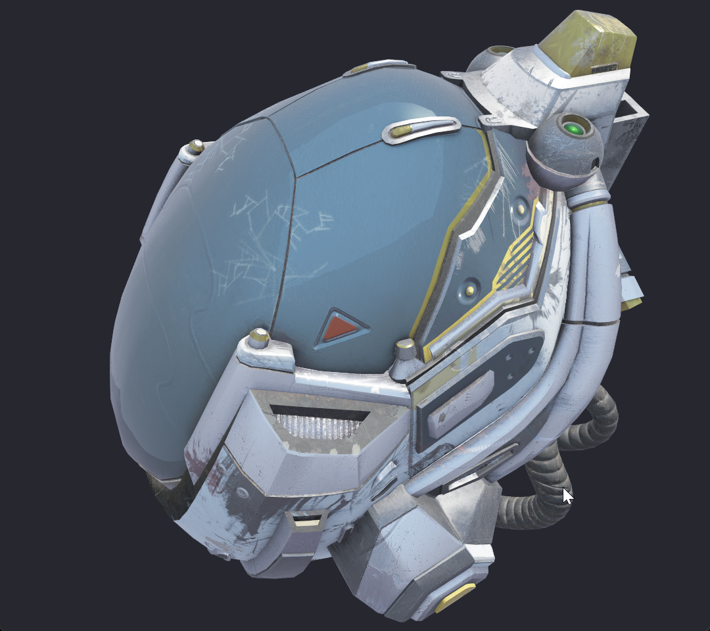

# vulkan_render

A Vulkan renderer written in modern C++23 (C++20 modules / `.cppm`), implementing a glTF 2.0 PBR (metallic-roughness) pipeline with CPU-precomputed split-sum IBL lighting.



## Features

- **Vulkan wrapper (`vulkan` module)**: C++ modules wrapping the full initialization flow — instance / device / swapchain / pipeline / descriptor set / command buffer. The `vulkan::runtime` facade sets up everything from window to swapchain in one line, caches named pipelines plus per-pipeline model lists, and renders a complete frame with a single `render_frame()` call (event polling, ESC/close handling, minimize skipping, swapchain recreation on restore/resize, fences, acquire, command buffers, render pass, submit and present are all internal — it returns a `frame_result` so the caller loop stays Vulkan/GLFW-free); a model owns all the GPU resources it needs to draw itself (geometry buffers, material + IBL descriptor set, per-frame camera UBO).
- **Dynamic rendering**: frames are rendered through `vkCmdBeginRendering` (Vulkan 1.3 dynamic rendering) when the device supports it — no render pass / framebuffer objects exist on that path; devices without dynamic rendering automatically fall back to a classic render pass + framebuffers. MSAA resolve works on both paths.
- **PBR rendering**: standard metallic-roughness workflow with five texture slots — albedo (sRGB), metallic-roughness, normal, occlusion, emissive — falling back to a 1×1 white texture when missing; material parameters are passed via push constants.
- **IBL lighting**: CPU-precomputed environment cubemap → GGX importance-sampled prefiltered environment (mip chain), irradiance map, and BRDF LUT (split-sum), uploaded as `R16G16B16A16_SFLOAT` cubemaps / `R16G16_SFLOAT` LUT.
- **glTF loading (`gltf_loader` module)**: standalone CPU module built on [fastgltf](https://github.com/spnda/fastgltf), supporting `.gltf` / `.glb` / data URIs and exporting a world-space flattened node hierarchy with raw de-interleaved vertex/index data.
- **Orbit camera**: left-drag to rotate, wheel to zoom, per-frame camera UBO updates, with `MAX_FRAMES_IN_FLIGHT` frames in flight.
- **Utility library (`utility` module)**: handle distribution, stack-style destructor mixin, `pmr` manager, thread pool, BVH, data block, and more (BVH / `better_pmr` / thread pool are reserved for future use).
- **Engineering practices**: automatic `clang-format` before every build, `-Wall -Wextra -Werror`, and **exceptions disabled in all build configurations** (`-fno-exceptions`; the vendored `std` module makes this work), plus `-flto -march=native -fno-rtti` in Release builds.

## Documentation

The project uses **Doxygen** for API documentation; every module, class, and interface is annotated in-source with `@defgroup` / `@brief`. The generated HTML is **not** committed to the repo (it would drown the source tree in generated files) — generate it yourself whenever you need it:

```bash
doxygen Doxyfile
```

Output: `docs/html/` (open `docs/html/index.html`) and `docs/latex/` (both gitignored).

Related source docs (tracked in the repo):

- [gltf_loader usage guide](docs/gltf_loader_usage.md) (API semantics, data formats, Vulkan integration examples)
- [docs/official-shaders/](docs/official-shaders/): reference shaders (IBL / PBR / primitive)

## Layout

```
├── main.cpp                 # Demo: pipeline loading + glTF model + PBR/IBL render loop
├── CMakeLists.txt           # CMake 4.3, C++23 modules build
├── Doxyfile                 # Doxygen config (PROJECT_NAME: "vulkan render")
├── vulkan/                  # vulkan modules (core / vma / handles / init_utils / pipeline / spirv_parser / model / math / runtime)
├── utility/                 # utility module (data_block / better_pmr / BVH / thread_pool; the latter three are reserved for future use)
├── gltf_loader/             # gltf_loader module (CPU-side glTF/GLB loading)
├── std/                     # std / std.compat modules (vendored libc++ module; required by the -fno-exceptions builds,
│                            #   avoids configuring CMake's experimental C++ modules flags)
├── shaders/                 # GLSL sources + precompiled SPIR-V (recompile via compile_shaders.ps1)
├── gltf_model/              # Sample model (DamagedHelmet)
├── snapshot/                # Screenshots
├── docs/                    # Usage guides + reference shaders; Doxygen HTML is generated on demand (gitignored)
└── third_party/             # Vendored dependencies (spirv-reflect)
```

## Dependencies & Build

### Requirements

- CMake ≥ 4.3 and a compiler with C++23 / C++20 modules support (this project uses MSYS2 clang64's clang)
- [Vulkan SDK](https://vulkan.lunarg.com/sdk/home) (includes `glslc`)
- System packages: `glfw3`, `glm`, `OpenSSL`, `fastgltf` (MSYS2 package; `libfastgltf.dll` + `libsimdjson.dll` must be on PATH), Vulkan Memory Allocator (VMA, `vma/vk_mem_alloc.h`)
- `spirv-reflect` is vendored under `third_party/`

### Build

Build directories are not committed to the repo, so pick any name — e.g. `build`:

```bash
cmake -S . -B build -G "Ninja" -DCMAKE_BUILD_TYPE=Release
cmake --build build
```

> `clang-format` runs automatically before compilation; a `clang-format-check` target is also provided for CI (check-only, no modifications).

### Run

Run from the project root or any build directory (the program walks upward to locate `shaders/` and `gltf_model/`):

```bash
./build/vulkan_render
# or load a different model:
./build/vulkan_render path/to/model.glb
```

By default it loads `gltf_model/DamagedHelmet.gltf` and renders it with PBR + IBL. Controls: **left-drag** to orbit, **wheel** to zoom, **ESC** to quit.

> Release builds are Windows GUI-subsystem executables: no console window appears when running, and the log output goes to `debug.log` in the working directory (the previous session's content is rotated to `debug.log.old` with a session timestamp on startup). Debug builds keep the terminal.

### Recompile shaders

```powershell
powershell -ExecutionPolicy Bypass -File shaders/compile_shaders.ps1
```

## License

[MIT](LICENSE) © 2026 YzK0741
